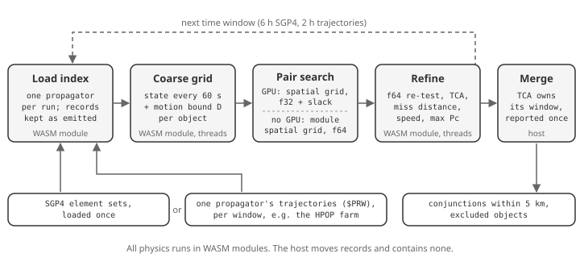

# Fast All-vs-All Conjunction Screening

Screening every catalog object against every other in seconds to minutes, for any propagator

Anthony "TJ" Koury III

Edgesource, Space Data Network · tj@edgesource.com

Technical whitepaper 1.5 | 2 October 2026

Numerical evidence cutoff: 2 October 2026

© Edgesource Corporation

## Executive summary

Space Data Network (SDN) screens the full public catalog, 32,514 objects, all-vs-all over three days in 19 s with SGP4 on ordinary processors, and in 21 s with a GPU. With numerical high-precision orbit propagation (HPOP) it takes about 8 minutes, almost all of it propagation. The screen finds every pair that comes within 5 km, and reports each close approach's time (TCA), miss distance, relative speed and maximum collision probability. The measurements were taken on one 28-core workstation, in Node.js and in a standard web browser. In WasmEdge, the runtime SDN nodes use, the SGP4 screen takes 23 s. Every run on one catalog and propagator reports the same conjunctions.

Five design choices produce that speed:

1. **A spatial grid proposes pairs; the module decides.** At every 60 s step, a uniform grid finds the pairs that could be close among the 528.6 million, on a GPU (WebGPU) or in the WebAssembly (WASM) conjunction module on CPU threads. The module re-tests each candidate in f64 and refines it. Every reported number comes from the module.
2. **Each trajectory bounds its own motion.** Between two samples, an object cannot stray from a straight line by more than a bound its trajectory source computes. A pair whose straight-line approach stays farther apart than the threshold plus both bounds cannot close, and is discarded without further work. The bound holds for any force model, maneuvers included.
3. **One propagator per run, in time windows.** A run screens either SGP4 element sets or one numerical propagator's trajectories, never a mix. Long screens run as consecutive windows, so memory stays at one window's trajectories while the next window is propagated.
4. **Load once, move records unchanged.** The catalog loads into the module once. A propagator's output passes into the conjunction module as the records it emitted, without re-encoding.
5. **Refinement proves, then solves.** Where the range of a pair provably has one minimum, Newton's method on the range rate finds it in about ten evaluations, instead of a dense scan.

The screen reproduces the module's single-call screen where both can run. On 4,000 objects over one day, all 1,068 conjunctions match, with TCA within 0.64 ms and miss distance within 5 mm; the single call takes 32.9 s and the windowed screen 0.44 s.

Against SOCRATES on the element sets SOCRATES itself used, TCA agrees within 0.5 ms and miss distance within 2.4 m for 95 % of cataloged pairs, the precision SOCRATES reports. Each event reports the covariance-free maximum probability. With an empirical model of element-set prediction error, events also carry a covariance-based probability. It is labeled calibrated only where held-out precise orbits confirm the covariance: LEO 600 to 800 km, 13,088 of the 292,516 three-day conjunctions. The model adds 1.1 s to the 19 s screen (section 7, [R1](#r1)).

Operators keep their most precise orbits and planned maneuvers private. Section 8 specifies **private screening**: two operators learn when their objects come close without exchanging trajectories, by computing distances on homomorphically encrypted positions.
- **Cost.** Its arithmetic is measured: 0.17 s and 8.7 MB per pair-day at 1 s steps.
- **What it reveals.** The paper shows how a naive design leaks distances, how invented trajectories can locate a hidden satellite, and which defenses stop that.
- **What it cannot hide.** Real close approaches reveal what safety requires.
- **Decoys.** Hiding a real orbit among N decoys bounds a prober's chance at e^(2ε)/N, but no decoy generator we measured is ready: the best hid a real orbit among about 4 of 100 candidates.
- **Status.** The protocol is not yet built.

## 1 The problem

An all-vs-all screen compares every object with every other: n(n − 1)/2 pairs, 528.6 million for 32,514 objects. A three-day screen at 60 s steps evaluates each pair at 4,321 instants, about 2.3 trillion pair-steps. A close approach at 10 km/s relative speed lasts under a second inside a few kilometers, so a coarse test that misses it loses the event.

The module's existing single-call screen (`screen_catalog`) uses a perigee/apogee prefilter and a k-d tree per time step. It holds every encounter of the window in WASM linear memory, at most 2 GiB. It runs out of memory above about 7,000 objects for a one-day window ([R2](#r2)).

## 2 Pipeline

  

The host code (JavaScript) moves records between the module and the GPU and contains no physics. The conjunction module, the SGP4 implementation, the HPOP propagator and the epoch-state converter are WASM modules. They are built with the SDN Module SDK and run unchanged in a browser, in the WasmEdge runtime and in its Docker image ([R3](#r3)).

| Stage | Where | Precision | Decides |
| --- | --- | --- | --- |
| Coarse grid | WASM module, threaded | f64 computed, f32 stored | Sample states and bounds |
| Pair search | GPU, WebGPU compute | f32 with 0.01 km slack | Candidates only |
| Pair search without a GPU | WASM module, threaded | f64 | Candidates only |
| Re-test and refinement | WASM module, threaded | f64 | Every reported result |
| Window merge | Host | Exact comparisons | Which window owns each TCA |

## 3 The candidate test

### Self-bounded motion

Let h be half the coarse step (30 s at 60 s steps). For a sample of an object at step k, with position r and velocity v, the trajectory source supplies a bound D such that the true position stays within D of the straight line:

$$
\lvert \mathbf{r}(t_k+\tau) - \mathbf{r}_k - \mathbf{v}_k\tau \rvert \le D \quad \text{for all } \lvert\tau\rvert \le h.
$$

Two objects can then come within the threshold d during the interval only if the straight-line relative path does so within d + D₁ + D₂. The test computes the clamped closest approach of the relative straight line over [−h, h] and compares it with that limit. A pair that fails the test at every step of an interval cannot close in it.

Each source kind computes D from what it knows:

| Source | Bound | Basis |
| --- | --- | --- |
| SGP4 element set | ½ A h², with A = 1.05 μ / r²_min and r_min = \|r\| − \|v\| h, floored at 6,000 km | SGP4 motion is unpowered; the 5 % margin covers J2 (0.16 % at the surface) and drag |
| Chebyshev trajectory (PPE) from any propagator | ½ A h² + (J + G) h + P | A bounds the position series' second derivative using \|T_k″\| ≤ k²(k² − 1)/3. J and P sum velocity and position jumps where intervals meet. G is the gap between the velocity series and the position series' derivative |

The trajectory bound uses only the coefficients, so it holds for any force model and for impulsive maneuvers that appear as interval jumps. A native test checks it against the trajectory itself every 0.1 s around samples taken every 7 s. The trajectory is a 7,000 km orbit interpolated as a propagator would export it, with a 5 m/s maneuver at an interval boundary. Tested at h = 30 s and h = 90 s, the bound was never exceeded, and away from the maneuver it was at most 1.34 times the true deviation ([R2](#r2)).

### Spatial grid

Testing all 528.6 million pairs at every step is wasted work: almost all pairs are thousands of kilometres apart. At each step, an object's straight-line segment over [−h, h], widened by d/2 + D, gives an axis-aligned box. Two objects can pass the straight-line test only if their boxes overlap, so a search over overlapping boxes drops nothing the test would pass.

The boxes go into a uniform grid whose cell is the 99th-percentile box edge. Each overlapping pair is counted once, in the cell holding the low corner of the two boxes' overlap. The few boxes that span four or more cells on an axis, such as fast perigee passes, are tested against every object. The same grid runs in two places:

- **On a GPU**, in three WebGPU compute passes per step. The first inserts each box into its cells, hashed into one lock-free list per slot. The second has each object walk its cells' lists. The third tests the large boxes.
- **Without a GPU**, in the WASM module on CPU threads: in a browser without WebGPU, in Node.js, or in WasmEdge on an SDN node or in Docker.

Either way, the grid proposes exactly the pairs an all-pairs test would. On the full catalog over three days, the GPU grid proposed the same 2,678,533 candidates as an all-pairs GPU kernel did.

SDN nodes run modules in WasmEdge compiled ahead of time. That needs SDN's patched WasmEdge 0.16.4: the stock compiler mishandles offsets on atomic memory instructions, and with it the full-catalog search hung in its second window. Interpreted WasmEdge is about 75 times slower.

### Two precisions, one decision

The GPU evaluates the test in f32. Positions near 7,000 km round to about 0.5 m in f32, so the GPU adds 0.01 km of slack and proposes a superset. The module repeats the test in f64 for every candidate. Over one day of the full catalog the GPU proposed 829,990 candidates and 828,910 passed the f64 test. Over three days the GPU proposed 2,678,533 and the CPU grid, which applies the f64 test directly, 2,675,123; both refine to the same conjunctions.

### Refinement

Passing steps of a pair join into encounters. Each encounter is refined by the same TCA search the single-call screen uses, so both report the same TCA.

For most encounters the search first proves that the range has one minimum in its window, then solves for it directly. Let A bound both objects' accelerations over the window; for SGP4 this is 1.05 μ / r²_min, the bound of the candidate test. With T the window's half-width and Δr, Δv the relative state at its middle:

$$
\lvert \Delta\dot{\mathbf r} \rvert \ge \lvert \Delta\mathbf v \rvert - \varepsilon - A T, \qquad \lvert \Delta\mathbf r \rvert \le \lvert \Delta\mathbf r_{\mathrm{mid}} \rvert + \lvert \Delta\mathbf v \rvert T + \tfrac12 A T^2 .
$$

ε (1 m/s) allows for a source's velocity differing from the rate of its position. If q = |Δr|max A / |Δṙ|min² < 1, the squared range is convex on the window. Its one minimum is then the root of the range rate f = Δr · Δv, and Newton steps of −f / |Δv|² converge by a factor q or better per step. About ten state evaluations reach the root to the resolution of a Julian date, about 47 µs.

Where the proof fails, for example a slow pair that stays close for minutes, the search samples the range every 5 s and refines each minimum it brackets with golden-section search. The earlier version used that path for every encounter. It also rescanned ±60 s at 0.05 s around each candidate minimum, tens of thousands of SGP4 evaluations per conjunction. Section 6 measures the change.

Probability uses the Alfano maximum ([R4](#r4)). When a refine call would stage more than the module's 16,384-event output limit, the host splits it in two.

## 4 One propagator per run

A run screens one propagator's output. A resident index holds either mean elements, evaluated with the module's SGP4, or trajectories from one generator, identified by the Chebyshev ephemeris (PPE) record's `EPHEMERIS_SOURCE`. The module refuses an index that mixes them (`mixed-propagators`).

Trajectories reach the module as their propagator exported them. The HPOP module's export is a size-prefixed `$PRW` record per object. The conjunction module's index preparation takes those records on its `trajectories` port without re-encoding, and the request carries only each object's identity. Trajectories in TT or TDB map to UTC linearly between their converted interval ends, using the vendored ERFA library ([R5](#r5)). TDB − TT is evaluated once per minute and interpolated, exact to about 1e-14 s.

## 5 Time windows

A long screen runs as consecutive windows; the merged result equals one screen of the whole span:

- A conjunction belongs to the window that holds its TCA.
- A TCA within the refinement tolerance of a shared edge is reported by both windows and kept once.
- An object excluded in any window, because its propagator cannot cover it there, has no conjunctions anywhere in the span. This matches the single-call screen's exclusion rule.

Window length trades memory for per-window overhead. A day of HPOP's trajectories is about 90 KB per object; a 2-hour window of the full catalog is about 400 MB. SGP4 windows reuse one index loaded at the start, so they are longer (6 hours).

Tests check four windows against a single screen for both propagators. The SGP4 case uses CelesTrak element sets that include an object SGP4 cannot propagate. The HPOP case uses HPOP-integrated crossing orbits passed through the `trajectories` port ([R2](#r2)).

### The HPOP propagation farm

1. The epoch-state module converts each element set into a GCRF state at its epoch: SGP4 at zero elapsed time, then TEME to GCRF through ERFA. This is the TLE-to-numerical handoff of the companion paper, section 5 ([R1](#r1)).
2. HPOP resident instances, at most 1,024 objects each, integrate those states on worker threads. The force model is the Earth's point mass and the EGM2008 degree/order 20 field, in Earth-fixed axes; there is no Sun, Moon, drag or radiation pressure. Objects are dealt round-robin into about two instances per worker, so element sets of every age spread evenly.
3. Each window, every instance exports the window and the records go to the browser unchanged. The next window is exported while the current one is screened.

HPOP integrates each object from its element epoch, so the first window carries that catch-up. HPOP drops cached intervals that end before the requested window, so an instance holds about one window per object.

## 6 Results

All runs used the Space-Track GP catalog of 30 September 2026, 32,514 objects ([R6](#r6)). Screens started 2026-10-01T00:00Z, with a 5 km threshold and 60 s coarse steps, on a Mac Studio with 28 cores and 27 module threads. GPU runs used headless Chrome with Metal for WebGPU. The workstation was shared with other work (1-minute load average 15–65 on 28 cores), so times are upper bounds.

### Full catalog, three days

| Propagator | Pair search | End to end | Sampling and search | Refine | Conjunctions |
| --- | --- | ---: | ---: | ---: | ---: |
| SGP4, 12 × 6 h | CPU, Node.js | 19.1 s | 9.7 s | 6.6 s | 292,516 |
| SGP4 | CPU, WasmEdge (AOT, SDN patches) | 22.9 s | 11.9 s | 8.7 s | 292,516 |
| SGP4 | GPU | 21.3 s | 6.1 + 2.3 s | 7.2 s | 292,516 |
| HPOP, 36 × 2 h | GPU | 482.5 s | 4.4 + 1.7 s | 7.5 s | 285,060 |
| HPOP | CPU, Node.js | 493.4 s | 16.8 s | 9.9 s | 285,060 |

- For each propagator, every run reports the same conjunctions with the same TCA and miss distance. SGP4 excluded 25 objects it could not propagate in the span; HPOP excluded none.
- **SGP4's** remaining time is sampling: 4,321 steps × 32,514 SGP4 evaluations. On the GPU path the module samples (6.1 s) and the GPU searches (2.3 s).
- **HPOP's** time is propagation: the screen waits about 454 s for the propagation farm, including the catch-up from element epochs in the first window. Screening and refining take under 30 s.
- The two propagators report different conjunctions. Neither result is a measure of accuracy (section 7).

### Step size

The candidate test is exhaustive at any step, so the step size trades sampling against candidates. SGP4, three days:

| Step | Candidates | CPU search | CPU end to end | GPU end to end | Conjunctions |
| ---: | ---: | ---: | ---: | ---: | ---: |
| 5 s | 4,748,277 | 92.1 s | 102.0 s | 98.6 s | 292,516 |
| 30 s | 1,414,694 | 17.8 s | 29.9 s | | 292,516 |
| 60 s | 2,675,123 | 9.7 s | 19.1 s | 21.3 s | 292,516 |
| 120 s | 17,116,089 | 10.0 s | 39.4 s | | 292,516 |

Every step size reports the same conjunctions, with miss distances within 2 mm. TCAs differ by up to 173 ms, but only on flat minima, where the miss distance is the same. A 5 s screen samples 12 times as often and finds nothing more. Shorter steps cost sampling; longer steps give larger bounds and more candidates. 60 s is near the optimum.

### How the time came down

Three days, SGP4, CPU search in Node.js, same host:

| Change | End to end | Refine |
| --- | ---: | ---: |
| Dense TCA scan around every minimum | 131.4 s | 114.3 s |
| Unimodal proof, golden-section search | 63.9 s | 45.6 s |
| Newton steps on the range rate | 55.3 s | 38.4 s |
| The same solve for each fast encounter's first pass | 34.7 s | 17.6 s |
| SGP4 state read without a lock; element sets converted once | 25.2 s | 12.7 s |
| Refinement work shared in small chunks; events built in parallel | 19.1 s | 6.6 s |

Every row reports the same 292,516 conjunctions. On the GPU path, replacing the all-pairs kernel with the grid cut the GPU search from 8.5 s to 2.3 s.

The first version also sent the whole catalog with every call. Loading it once into the module cut one day of the full catalog from 266.7 s to 55.4 s, with the same 77,667 conjunctions.

### Agreement with the single-call screen

| Objects, window | Single call | Windowed, CPU search | Conjunctions | Largest difference |
| --- | ---: | ---: | --- | --- |
| 2,000, 0.1 day | 1.1 s | 0.08 s | 23 of 23 | TCA 0.16 ms, miss 0.6 mm |
| 4,000, 1 day | 32.9 s | 0.44 s | 1,068 of 1,068 | TCA 0.64 ms, miss 5 mm |

On the 2,000-object case the CPU search and the GPU found the same 424 candidates and 23 conjunctions, in Node.js, WasmEdge and a browser. Differences from the single call come from refinement starting from different coarse brackets, and sit inside the module's parity tolerances of 10 ms and 10 cm. Against the earlier dense scan, Newton's method found a deeper minimum for 225,968 of the 292,516 conjunctions. No TCA moved more than 5.4 ms and no miss distance more than 24 cm.

### Validation findings

The work found these defects in existing code, all fixed:

- The module's generic pair search, used for tabulated and polynomial trajectories, sampled the range at the coarse step. It missed fast crossings: for one pair it reported a 41.9 km approach and missed a 500 m meeting. It now uses the same 5 s search as the SGP4 path.
- HPOP could not export a window starting on one of its 10-minute interval boundaries after the first. A Julian date resolves to about 4.7e-10 day, and the interval lookup's 1e-12-day check refused the boundary.
- HPOP's gravity was wrong in three ways, found by calibrating its covariance against reference orbits (section 7):
  - **Inertial axes.** The field was evaluated in inertial axes: the tesserals did not turn with the Earth, and the pole was off by the precession since 2000.
  - **A partial field.** The built-in "degree/order 20" field held only J2–J6 and the tesserals through degree 4, with J5 and J6 wrong.
  - **Frames and clock.** Its nutation and Earth-fixed rotation were 0.74° off, and an unset force clock read Julian date 0.

  Now the field is EGM2008 to degree and order 20, in Earth-fixed axes that match ERFA to 0.2 arcsec. Six days from an element-set epoch, an LEO arc's error against reference orbits fell from 5.9 km to 0.2 km radially and from 10.9 km to 0.2 km out of plane. The HPOP rows above are from the corrected propagator; before the fix the same screen reported 301,396 conjunctions.

## 7 Uncertainty and probability of collision

The companion paper sets the conditions this screen respects ([R1](#r1), sections 5, 9, 12 and 16.2):

- A TLE supplies no covariance. The initial uncertainty of a TLE-seeded HPOP trajectory, including this paper's HPOP runs, is unknown until a validated representation exists.
- A probability of collision requires relative-state uncertainty with independent calibration and stated cross-correlation, geometry and hard-body-radius assumptions.

Every event reports the Alfano maximum: the largest probability any covariance size could give for the reported miss distance and combined hard-body radius ([R4](#r4)). It needs no covariance and serves as an upper bound. Each object's radius comes with its basis: supplied, half the catalog size, from the radar cross section, or the request default. No uncertainty is invented: an event carries covariance, and a covariance-based probability, only when a source supplied covariance or the empirical model below applies, and it states which. The work below follows the companion paper's three parts: initial covariance, propagation, and calibration on held-out evidence ([R8](#r8)).

### Independent truth

Calibration needs reference orbits that SGP4 did not produce. SDN's reference-states module turns precise orbits into GCRF states at stated times, each with its stated uncertainty as covariance and its provenance ([R10](#r10)):

- IGS final GPS orbits;
- ILRS orbits for LAGEOS-1/2, ETALON-1/2, Ajisai, Starlette, Stella, LARETS, WESTPAC, LARES and LARES-2;
- Sentinel-1C/1D precise orbits;
- Swarm A/B/C precise orbits.

Their frames are converted with IERS Earth orientation parameters. For 2026-08-02 to 15, this gives 48 objects. The conversion matches an independent pyerfa computation within 1 mm, and a Vallado textbook case within its printed precision.

### An empirical error model, and its calibration

A model of SGP4 prediction error was built from 1.89 million element sets (2026-07-12 to 08-08), stratified by orbit regime and prediction age. It uses differences between consecutive element sets of the same object. Those differences are not truth, and the reference orbits show by how much:

- From 600 km up, under half a day, they understate the true along-track error 4 to 11 times, because consecutive fits share their error.
- Below 600 km they overstate it, by 10 to 90 times beyond a day.

The calibration gate scales each stratum's covariance on one week of reference orbits (08-02 to 08), then tests it on the next (08-09 to 15). It compares each error's Mahalanobis distance with χ² on 3 degrees of freedom, and every sample counts. A stratum is CALIBRATED only when all of these hold:

- its 1σ and 2σ containment are within 5 points of nominal;
- no more than 1 % falls outside 3σ;
- it has at least 30 samples from at least 3 objects.

| LEO 600 to 800 km, prediction age | Samples (objects) | Inside 1σ / 2σ / 3σ | Label |
| --- | ---: | --- | --- |
| 0 to 0.5 day | 14,968 (4) | 0.642 / 0.954 / 0.997 | CALIBRATED |
| 0.5 to 1 day | 14,876 (4) | 0.627 / 0.947 / 0.996 | FAILED |
| 1 to 2 days | 31,327 (4) | 0.647 / 0.943 / 0.997 | CALIBRATED |
| 2 to 3 days | 31,805 (4) | 0.636 / 0.922 / 0.994 | CALIBRATED |
| 3 to 5 days | 58,981 (4) | 0.701 / 0.960 / 0.997 | CALIBRATED |
| 5 to 7 days | 49,187 (4) | 0.728 / 0.965 / 0.991 | CALIBRATED |
| Nominal | | 0.683 / 0.954 / 0.997 | |

Every other stratum is UNCALIBRATED:

- **GPS and the other MEO strata fail**, for example 0.37 / 0.70 / 0.89 for LAGEOS-1/2 and LARES-2 within half a day. GPS element sets carry per-satellite along-track offsets of −1.6 to +3.8 km.
- **The other LEO bands have only one or two reference objects.**
- **GEO, eccentric and beyond-GEO orbits have no independent truth here.**

The labels hold for these objects in this week.

### Covariance probability on screened events

With the scaled model, element-set screens give each event's objects the covariance of their stratum at the TCA's prediction age. The event then reports the selected method's probability, Foster's by default ([R9](#r9)). Each event is labeled:

- the covariance as synthesized from the empirical model;
- the two objects' errors as independent;
- calibrated only when both objects' strata passed the gate.

On the three-day full catalog the screen found the same 292,516 conjunctions:

- 288,105 received a covariance probability;
- 13,088 of those are calibrated;
- refinement took 7.8 s instead of 7.0 s, and the run 19.6 s instead of 18.5 s.

Events outside the model keep the Alfano maximum. These are a negative or too-old prediction age, or a stratum the model lacks.

### Propagated and fitted covariance

- **Propagation.** HPOP resident instances now accept an initial covariance P₀ per object and return P(t) = Φ P₀ Φᵀ + Q. Q is a declared white-acceleration process noise, inertial or radial-transverse-normal, given as a spectral density and discretization interval. It is recorded in the trajectory (SDS 1.232.0). The state transition matrix matches finite differences, and Q matches its closed form.
- **Orbit determination.** Fits publish their formal covariance as an OCM. The OCM lists the noise models, weighting, observations used, process noise, a priori and convergence criteria, with biases neither estimated nor considered and no consider parameters. It is marked Uncalibrated.
- **HPOP covariance, calibrated in part.** It was checked the same way as the empirical model, for this paper's HPOP screen product: an element-set epoch state with P₀ measured at the epoch, then HPOP's resident force model. A white-acceleration Q was fitted by maximum likelihood on the fit week; a regime kept Q = 0 where P₀ alone passed more fit-week strata ([R8](#r8)).
  - **LEO 600 to 800 km, 0 to 3 days: CALIBRATED with P₀ alone.** P₀ carried through HPOP's state transition matrix predicts the along-track growth, 1.3 to 17 km, within 10 %.
  - **LEO 600 to 800 km beyond 3 days: FAILED.**
  - **GPS: FAILED.** The resident model has no Sun or Moon, which drive GPS errors.
  - **Other bands: INSUFFICIENT.**
- **Orbit-determination covariance is not calibrated.** Covariance supplied in an OEM or OCM enters conjunction assessment as supplied covariance and keeps the source's calibration label.

### Agreement with SOCRATES

SOCRATES is CelesTrak's public conjunction screen ([R7](#r7)). The replay used the top 300 rows of its 2 October 2026 maximum-probability report, from 179,398 rows. Each pair was reassessed from the element sets SOCRATES used for it, and the report and every input are hashed. The days since epoch agree to SOCRATES's printed precision, which confirms the inputs are identical.

| Group | Rows | TCA median / p95 / max | Miss distance median / p95 / max |
| --- | ---: | --- | --- |
| Cataloged pairs, faster than 10 m/s | 112 | 0.4 / 0.5 / 24 ms | 0.38 / 2.4 / 6.6 m |
| Pairs with an object numbered 100000 or above | 126 | 0.4 / 4.2 / 7.6 ms | 0.58 / 20.8 / 61 m |
| One formation pair, 0 to 5 m/s | 62 | 19 / 69 / 363 ms | 0.26 / 0.47 / 0.51 m |

SOCRATES prints range to 1 m and speed to 1 m/s, so the cataloged pairs agree to its reported precision. Every fast miss difference over 20 m involves an object numbered 100000 or above, mostly Starlink, and the published inputs do not show why.

Maximum probability is about nine times lower here at a 10 m combined radius. That matches SOCRATES using larger, object-specific radii, which it does not publish: a combined radius of 30 m (median) would reproduce its values. For the formation pair, a short-term encounter does not hold for either computation, so the probabilities are not comparable.

### Screening rules compared

The companion paper's section 12 compares probabilistic, bounded-set and admissible-set screening ([R1](#r1)). Cases were built from real SGP4 errors against the held-out reference orbits:

- two different objects' errors in one stratum make one encounter;
- each encounter is placed head-on and at a 90° crossing;
- synthetic true misses are added from 0 to 5 km;
- a collision is a true miss within 20 m.

The three rules alert as follows:

- **Probabilistic:** Foster's probability ≥ 1e-4.
- **Bounded set:** the 99.73 % relative ellipse comes within 20 m.
- **Possibility:** min-joined χ² possibility per object, alerting unless the necessity of no collision reaches 0.9973. Possibility and necessity are not probabilities ([R1](#r1), section 9).

The results, in the calibrated strata (10,000 cases a row):

| Rule | Missed collisions, head-on | Missed collisions, crossing | False alerts at 1 km miss | False alerts at 2 km miss |
| --- | ---: | ---: | ---: | ---: |
| Probabilistic | 2.7 % | 16 % | 6 to 7 % | 0 % |
| Bounded set | 0.2 % | 0.4 % | 21 to 45 % | 0 to 4.5 % |
| Possibility | 0 % | 0 % | 69 to 89 % | 4 to 24 % |

- **Probabilistic.** Along-track uncertainty here is 0.6 to 3 km, so a true collision's probability averages only 0.002 head-on and 0.0006 crossing. This is dilution, and it is what hides the collisions the probability rule misses.
- **Possibility.** It missed none in calibrated strata, at the cost of the most false alerts. In uncalibrated strata it missed up to 8 %, so it is only as sound as its declared uncertainty.
- **Disclosure.** The baselines and cases were chosen independently of the TEAG and ESPF authors' implementations, and no TEAG or ESPF code was run.

## 8 Private screening

Operators hold back their best data:
- **National security.** Classified orbits reveal capability and coverage.
- **Commercial value.** Constellation geometry and station-keeping are trade
  secrets.
- **Maneuver intent.** A planned burn tells competitors and adversaries that
  something is changing.
- **Liability.** Sharing creates obligations.

Without that data, the screen in this paper sees catalog estimates where
precise trajectories exist. Private screening lets two operators learn when
their objects come close without either seeing the other's trajectory.

This section specifies the protocol, measures its arithmetic, and analyses
what it reveals and how it can be abused ([R14](#r14)). It also measures
whether decoy orbits can hide a satellite ([R16](#r16)). **It is not yet
built.** SDN's encrypted-screening endpoint accepts requests and returns no
result.

### What is computed on ciphertext

A (the requester) and B (the responder) each hold a trajectory, sampled on a
common time grid. A wants to know when B's object passes within R of its own.
The protocol uses homomorphic encryption: B computes on A's encrypted
positions without being able to read them ([R11](#r11), [R12](#r12)).

1. **A encrypts its trajectory under its own key.**
   - The quantities are x, y, z and |a|², in integer metres.
   - 8,192 time steps are packed per ciphertext (BFV, n = 8192, 128-bit
     security).
   - Three 60-bit plaintext moduli, recombined by the Chinese remainder
     theorem, hold the range, so no value wraps.
2. **B computes on ciphertext.** Since |a − b|² = |a|² − 2a·b + |b|², B forms
   Enc(|a − b|² − R′²) using only products of its own plaintext with A's
   ciphertext. It never multiplies two ciphertexts.
3. **A decrypts.** It learns, for each step, whether B is within R′.

A pair can come within R between two samples. Testing against
R′ = √(R² + (v_max Δt / 2)²) catches every such approach. With
v_max = 15.5 km/s, R′ is 9.2 km at 1 s steps and 77.7 km at 10 s steps.

**Key custody.**
- Only A ever decrypts, and no key leaves A.
- No third-party assessor is involved. A party holding the key that decrypts
  the result can also decrypt every input it receives under that key, so an
  assessor that decrypts adds trust without adding privacy.

### Rules of the exchange

**Fixed grid.**
- Every encrypted trajectory uses a grid set by the protocol: UTC-aligned
  windows, a fixed step Δt, and 8,192 steps per encrypted block.
- Slot j always means t₀ + jΔt, so a requester cannot choose its own sample
  times.

**One answer per pair and window.**
- B answers once per (counterpart object, window).
- It checks every step of the window, never a subset.
- A accepts one digitally signed response per pair, so it cannot ask twice
  and keep the better answer.

**Completeness audit.** Two stages:
1. **Structure, before answering, without decrypting.** B checks:
   - the window identifier and start epoch;
   - the step;
   - the number of encrypted blocks per coordinate (steps ÷ 8,192);
   - the encryption parameters.

   A short or malformed submission is refused.
2. **Content, under encryption.** A missing or zero-filled step is still a
   valid ciphertext, so structure alone cannot reveal it. The tube check
   (defense 1 below) tests every step, and a blank or invented step is not
   near the declared object's track.

**What can be verified under encryption.**
- **Before answering:**
  - the structure;
  - whether every step lies inside the tube around the declared object's
    public track.

  The tube test is the screening arithmetic against that track, followed by
  the comparison. B learns only pass or fail.
- **Not in real time:** whether the path obeys the equations of motion.
  Gravity (μr/|r|³) is not a polynomial, and homomorphic arithmetic only adds
  and multiplies. Zero-knowledge proofs of orbital dynamics remain research.
- **After the window:** everything, by opening the ciphertexts that were
  answered (defense 2 below).

### What it costs

Measured with Microsoft SEAL 4.1.1 on one core of the shared workstation
([R14](#r14)):

| Step | R′ | A: encrypt and upload, per object-day | B: compute, per pair-day | B: response, per pair-day | A: decrypt, per pair-day |
| --- | ---: | ---: | ---: | ---: | ---: |
| 1 s | 9.2 km | 179 ms, 34.6 MB | 169 ms | 8.7 MB | 163 ms |
| 10 s | 77.7 km | 22 ms, 4.2 MB | 21 ms | 1.0 MB | 20 ms |

- **Correctness.** Over 86,400 one-second steps for eight pairs, every step
  matched the plaintext distance.
- **Detection.** Each designed 2 km encounter raised three to six alert steps.
  A control pair 60 km apart raised none at 1 s steps.
- **Scale.** One private object screened against 1,000 objects for three days
  at 1 s steps costs B about 510 core-seconds and 26 GB of responses. Private
  screening suits operator-to-operator subsets; the open screen covers the
  catalog.

### What the result reveals

The intended output is the set of steps at which B is within R′, and nothing
more.

**A naive design leaks the distance.**
- The obvious way to hide the distance is to multiply each step's value by a
  fresh random factor and let A read only its sign. One step's value then
  bounds the distance only loosely.
- Neighbouring steps, however, have almost the same distance. Intersecting
  the bounds of 64 neighbouring steps, A recovered the distance within a
  factor of 2 at 87 % of steps (1 s grid). That is enough for range-only
  orbit determination of B's object.
- The output must therefore be one bit per step: B adds a random additive
  mask, and A and B run a two-party secure comparison that reveals only the
  sign ([R13](#r13)).
- B's response must also be noise-flooded, so that its ciphertext noise
  carries nothing about b.
- Neither step is built or measured here.

**Real conjunctions reveal what safety requires.** Each alert places the
other object within R′ of a known object at a known time. In this paper's
3-day SGP4 screen, 2,532 objects outside Starlink came within 5 km of a
Starlink satellite:
- 1,304 of them did so three or more times;
- 668 did so ten or more times.

Kuiper, OneWeb and Qianfan had 857, 452 and 571 such objects, mostly with one
to four conjunctions each. A private object in a crowded shell therefore
gives its densest neighbour enough position fixes for a coarse orbit within
days. Private screening hides an orbit from operators it does not approach.
It cannot hide it from those it does.

### Orbit guessing

The probing attack:
- **The query.** A requester submits invented trajectories, rather than its
  real object, to find B's object. Each step then answers whether B is
  within R′ of a chosen point at a chosen time.
- **The cost.** Low Earth orbit (200–2,000 km altitude) holds about
  1.27 × 10¹² km³, and a 9.2 km ball is about 3,300 km³. A first hit with no
  prior takes about 3.9 × 10⁸ steps: 47,000 one-window queries. At the
  measured rates, B pays about 760 core-seconds and 39 GB of responses.
- **With a prior.** If the prober knows the shell (±25 km at 700 km), it
  needs about 1,200 queries, costing B 20 core-seconds and 1 GB.
- **After a first hit,** orbital dynamics narrow the search quickly.
- **In reverse.** The responder can probe the requester through its
  reactions. A disclosure request or a maneuver after an alert reveals
  proximity to an invented trajectory.

Unbounded querying is therefore cheap enough for a determined adversary. In
mutual screening both operators can attempt it: each is a requester for its
own object and a responder for the other's.

**Who enforces the defenses.**
- Every answer about an object comes from its owner's node, computed with
  its owner's plaintext trajectory. Nothing that could reveal the object
  exists anywhere else.
- The requester's software, modified or not, holds only its own data and
  results locked under its own key.
- The defenses below therefore run on the node of the party being probed.
  Open source does not weaken them; it lets each party check what its
  counterpart's node computes.
- A central service computing on everyone's encrypted orbits would reverse
  this, which is one more reason the protocol has none.

The defenses, strongest first:

1. **Check the question before answering.**
   - Each query must name a declared object that the requester operates.
   - Under encryption, the responder tests that the submitted trajectory
     stays within a tube around that object's public track. The tube is D₀
     wide at the start and widens by Δv_max·(t − t_b) after a burn declared
     at t_b, so planned maneuvers pass.
   - The test uses the two-party comparison above, and the responder learns
     only pass or fail. An invented sweep is refused before any answer is
     computed.
   - Probing with its real fleet, a requester reaches at most D + R′ around
     each of its satellites.
2. **Open the window afterwards.**
   - Each window is encrypted under a fresh key. The responder keeps the
     ciphertexts it answered (34.6 MB per object-day at 1 s steps).
   - After the window has passed, the requester hands over that window's
     key. The responder decrypts exactly what it answered: past positions,
     far less sensitive than planned maneuvers.
   - The ciphertext is the commitment: it cannot be swapped afterwards, and
     no separate hash is needed.
   - The responder checks every step and orbital dynamics, flagging grids,
     sweeps and non-Keplerian paths. It also checks agreement with
     independent tracking of the declared object, using the reference-orbit
     comparisons of section 7.
   - Queries and responses are digitally signed, so a failure is
     attributable evidence. Withholding the key counts as a failure.
3. **Stake and identity.** Only identities with stake or reputation may ask.
   A failed check forfeits the stake and ends screening for that identity.
4. **Per-window budget.**
   - An identity may ask no more questions per window than it has
     registered objects.
   - That bounds what a requester willing to lose its identity can extract
     before the later check catches it: one window of questions, inside the
     tubes of its own fleet.
5. **Laplace noise with a safety offset.** Before the comparison, the
   responder adds noise drawn from a Laplace distribution of scale b to each
   step's distance. The noise is truncated at ±s, and the test threshold is
   raised by s, so noise can add false alerts but never removes a real one.
   - **It hides the precise position.** Two placements of the hidden object
     whose distances to the probe differ by Δ change the odds of each answer
     by at most e^(Δ/b), and of k answers by e^(kΔ/b). This is differential
     privacy. With b = 250 m, ten answers barely separate positions 25 m
     apart.
   - **Finding the boundary is expensive.** Locating the alert boundary to
     within δ takes about (b/δ)² answers, more than the budget allows.
   - **It does not hide coarse location.** An object 1,000 km away is never
     "close". The noise complements the checks above; it does not replace
     them.
   - **Repeats don't help.** The noise is fixed per requester, object and
     step, so asking again does not average it away. Because of the
     truncation, the guarantee is approximate ((ε, δ)) differential privacy.
   - **Cost.** The alert radius grows by s. With s = 1.25 km at R = 5 km,
     there are about 1.6 times as many alerts to resolve.
6. **Partners for untracked objects.** An object missing from the public
   catalog cannot pass a public-track check. Its owner screens only with
   counterparties it agrees to work with, and they with it.

Direct authenticated streams protect integrity and metadata. The ciphertexts
are protected by their owner's key either way.

With these defenses in place, a prober learns what its real objects' real
close approaches reveal. If it is willing to lose its identity, it learns at
most one more window of answers, within its own fleet's tubes.

### Decoys

The owner of a satellite missing from the public catalog can submit N
candidate orbits: one real and N − 1 decoys. Only its key says which answers
matter, so a prober's positives are mostly decoys.

**What decoys add:**
- **They don't depend on the gate.** If the checks above are ever bypassed, a
  prober maps a cloud of N orbits, not one.
- **They hide whether a hidden satellite exists.** An owner that always
  submits about N candidates reveals neither whether it has hidden
  satellites nor how many.

**The bound.**
- Let p be the prober's belief about real orbits and q the decoy
  distribution. If e^(−ε) ≤ p/q ≤ e^(ε) everywhere, no prober finds the real
  orbit with probability above e^(2ε)/N.
- With q = p, the probability is exactly 1/N.
- The bound holds only when three conditions are met:
  - **Persistence.** Decoys are drawn once and then evolve like real orbits.
    Redrawn each window, they leak up to e^(Tε) over T windows.
  - **No observations.** A prober that tracks the satellite itself finds it.
  - **Gated confirmation.** Honest neighbours must learn which alerts are
    real, so confirmation goes through the checks above.

**Cost.** Screening work grows N-fold on the side that uses decoys. From the
measured cost per pair-day:

| Decoys (N) | 1 s steps | 10 s steps |
| --- | --- | --- |
| 1,000 | about 3 core-minutes, 9 GB | about 21 core-seconds, 1 GB |
| 10,000 | about 28 core-minutes, 87 GB | about 3.5 core-minutes, 10 GB |

Decoys on both sides of a pair multiply to N².

**Measured ([R16](#r16)).**
- **Setup.** Five decoy generators on 3,000 LEO payload histories (14 days,
  August 2026), one decoy per real orbit per generator. A cross-validated
  classifier tried to tell real from decoy. Its searches included the
  nearest public object and replayed public sequences.
- **Views.**
  - Element sets.
  - Published ephemeris: daily windows propagated by HPOP, 251,770 windows.
- **Metric.** The number of candidates out of 100 that the real orbit
  effectively hides among. 100 is ideal.

| Generator | Element sets | Published ephemeris |
| --- | ---: | ---: |
| Random orbits | 1.0 | 1.1 |
| Rotated copies of public objects | 1.0 | 5.2 |
| Resampled noise | 1.0 | 1.6 |
| Real changes replayed from a random start | 4.3 | 3.3 |
| Real changes replayed in their own time | 2.9 | 4.2 |

- **Invented noise is recognised by its statistics.** Real element sets drift
  from SGP4's node rate, and consecutive sets agree more closely than
  independent noise allows.
- **Copied noise is recognised in two ways:**
  - by correlation with the public histories it came from;
  - by sitting farther from any public object than real satellites, which
    share tight shells. The median catalog distance was 2.8 against 0.56 in
    the published ephemeris.
- **The worst case decides.** Even at an AUC of 0.90, 7 % of real histories
  scored above a threshold that no held-out decoy reached. Those are found
  whatever N is (ε ≥ 3.4 at 95 %).
- **The published ephemeris hides more than element sets,** and it is the
  only view the protocol exposes.

**What a working generator needs:** pipeline equivalence.
- Decoy ephemerides must come from the owner's own pipeline: simulated
  tracking with fresh noise, the same orbit determination and the same
  propagator.
- Decoys must sit inside real shells.
- The generator must be measured this way before use.

Until then, decoys dilute what leaks behind the checks above; they do not
replace them.

### What exists

| Piece | State |
| --- | --- |
| Homomorphic fields in FlatBuffers (SEAL BFV/BGV, `he_encrypted`) ([R15](#r15)) | Built. Each ciphertext holds one value under a 20-bit plaintext modulus, so metre-scale coordinates wrap silently. It needs batched vectors and multiple moduli, as in the benchmark, to carry this protocol. |
| SDN encrypted-screening request (`/api/v1/conjunction/screen`) | Built. It returns no result. |
| The protocol's arithmetic | Measured ([R14](#r14)). |
| Decoy generators and their measurement ([R16](#r16)) | Measured. No generator is ready. |
| Screening module, bit-only comparison, pre-answer tube check, completeness audit, noise flooding, Laplace noise, per-window keys and audit, staking, budgets | Not built. |

## 9 Limits and next work

| Limit | Effect | Next step |
| --- | --- | --- |
| SGP4 sampling | About half of a 19 s screen: 140 million SGP4 evaluations | Fewer evaluations per step only with a bound that stays exhaustive |
| HPOP propagation | Over 90 % of the HPOP screen | Force-model choices and initial states nearer the screen start; both are modeling decisions with accuracy consequences |
| Catch-up from element epochs | The first HPOP window waits for every object to reach the screen start | Persistent propagation across screens |
| Memory per window | About 400 MB per 2-hour HPOP window | Window length chosen per host |
| One host | All timings from one shared 28-core workstation | Repeat on other hosts, GPUs and Docker containers ([R2](#r2) includes the procedure) |
| Calibration coverage | Covariance calibrated only in LEO 600 to 800 km (empirical model; HPOP to 3 days), for 48 reference objects in one week | More precise-orbit missions, object-class strata, HPOP with the Sun and Moon, and orbit-determination covariance |
| Probability inputs | Combined radius and covariance shape differ from SOCRATES's unpublished ones | Published per-object radii with their basis |
| Private screening | Designed and measured, not built | A screening module with a bit-only comparison, noise flooding, a pre-answer tube check, and per-window keys opened and audited against tracking; a pipeline-equivalent decoy generator (section 8) |

This paper reports computation speed, agreement between implementations and with SOCRATES on identical inputs, and covariance calibration where independent truth exists. It does not establish operational readiness, or accuracy for objects and regimes without independent reference orbits.

## References

### R1

Koury, A. and Jah, M. K. Evidence-Supported ASO Catalog. Space Data Network technical whitepaper 1.8.1, revised 1 October 2026. [Paper](evidence-supported-aso-catalog.md)

### R2

Edgesource. Conjunction assessment module: all-vs-all screening on a GPU or on CPU threads, time windows, TCA solve, parity and bound tests, and the benchmark procedure. Modules commit e1e9b6b8b9a9c5257eab5d447a668e1886a4fa71. [Method](https://github.com/DigitalArsenal/space-data-network-modules/blob/e1e9b6b8b9a9c5257eab5d447a668e1886a4fa71/analysis/conjunction-assessment/docs/gpu-all-vs-all.md) · [Benchmark](https://github.com/DigitalArsenal/space-data-network-modules/blob/e1e9b6b8b9a9c5257eab5d447a668e1886a4fa71/analysis/conjunction-assessment/docs/benchmark.md)

### R3

Edgesource. Space Data Module SDK 0.8.26. [Repository](https://github.com/DigitalArsenal/space-data-module-sdk)

### R4

Alfano, S. Relating Position Uncertainty to Maximum Conjunction Probability. AAS 03-548, 2003. [Paper](https://celestrak.org/SOCRATES/AIAA-03-548.pdf)

### R5

ERFA (Essential Routines for Fundamental Astronomy), BSD-3, derived with permission from IAU SOFA. Vendored in the modules repository. [Project](https://github.com/liberfa/erfa)

### R6

Space-Track.org. General perturbations element sets, catalog snapshot of 30 September 2026. [Service](https://www.space-track.org)

### R7

CelesTrak. SOCRATES conjunction screening service. [Service](https://celestrak.org/SOCRATES/)

### R8

Edgesource. Conjunction uncertainty program: reference states, GP prediction-error model, calibration gate, covariance probability on screened events, HPOP process noise, orbit-determination covariance, SOCRATES replay, screening evaluation and HPOP covariance calibration. Modules commit 82a566fd2cafc062a43643c8855cc7fd371155cd. [Reference states](https://github.com/DigitalArsenal/space-data-network-modules/blob/82a566fd2cafc062a43643c8855cc7fd371155cd/analysis/reference-states/README.md) · [Validation](https://github.com/DigitalArsenal/space-data-network-modules/blob/82a566fd2cafc062a43643c8855cc7fd371155cd/analysis/gp-error-model/docs/validation-2026-08.md) · [Calibration](https://github.com/DigitalArsenal/space-data-network-modules/blob/82a566fd2cafc062a43643c8855cc7fd371155cd/analysis/gp-error-model/docs/calibration-2026-08.md) · [Conjunction module](https://github.com/DigitalArsenal/space-data-network-modules/blob/82a566fd2cafc062a43643c8855cc7fd371155cd/analysis/conjunction-assessment/README.md) · [HPOP](https://github.com/DigitalArsenal/space-data-network-modules/blob/82a566fd2cafc062a43643c8855cc7fd371155cd/propagator/hpop/README.md) · [SOCRATES replay](https://github.com/DigitalArsenal/space-data-network-modules/blob/82a566fd2cafc062a43643c8855cc7fd371155cd/analysis/conjunction-assessment/docs/socrates-replay-2026-10-02.md) · [Screening evaluation](https://github.com/DigitalArsenal/space-data-network-modules/blob/82a566fd2cafc062a43643c8855cc7fd371155cd/analysis/gp-error-model/docs/screening-evaluation-2026-08.md) · [HPOP calibration](https://github.com/DigitalArsenal/space-data-network-modules/blob/82a566fd2cafc062a43643c8855cc7fd371155cd/analysis/gp-error-model/docs/hpop-calibration-2026-08.md)

### R9

Foster, J. L. and Estes, H. S. A Parametric Analysis of Orbital Debris Collision Probability and Maneuver Rate for Space Vehicles. NASA JSC-25898, 1992.

### R10

Precise orbit products: IGS final orbits ([IGS](https://igs.org/products/)), ILRS analysis-centre orbits ([ILRS](https://ilrs.gsfc.nasa.gov/)), Copernicus Sentinel-1 precise orbit ephemerides ([ESA](https://sentinels.copernicus.eu/)), Swarm precise orbits ([ESA](https://earth.esa.int/eogateway/missions/swarm)), and IERS EOP 20 C04 ([IERS](https://www.iers.org/)).

### R11

Microsoft Research. Microsoft SEAL 4.1.1, homomorphic encryption library. [Repository](https://github.com/microsoft/SEAL)

### R12

Fan, J. and Vercauteren, F. Somewhat Practical Fully Homomorphic Encryption. IACR Cryptology ePrint Archive 2012/144. [Paper](https://eprint.iacr.org/2012/144)

### R13

Damgård, I., Geisler, M. and Krøigaard, M. Efficient and Secure Comparison for On-Line Auctions. ACISP 2007, LNCS 4586.

### R14

Edgesource. Private screening: protocol, SEAL benchmark, leakage and exposure measurements, exchange rules and defenses. Modules commit 4705b77424a4f169971f856dac220a0bf4809cc5. [Note](https://github.com/DigitalArsenal/space-data-network-modules/blob/4705b77424a4f169971f856dac220a0bf4809cc5/analysis/conjunction-assessment/docs/private-screening.md) · [Benchmark](https://github.com/DigitalArsenal/space-data-network-modules/tree/a7d6b38155e5139ea3100643ef8fc7ff5749bd46/analysis/conjunction-assessment/bench/private-screening)

### R15

Edgesource. FlatBuffers homomorphic encryption. [Documentation](https://github.com/DigitalArsenal/flatbuffers/blob/master/docs/source/homomorphic_encryption.md)

### R16

Edgesource. Decoys for private screening: principle and measurement. Modules commit e87cb5d4d2f6f33b2dde9463fbd10506d6414f02. [Note](https://github.com/DigitalArsenal/space-data-network-modules/blob/e87cb5d4d2f6f33b2dde9463fbd10506d6414f02/analysis/private-screening/docs/decoy-study-2026-08.md) · [Module](https://github.com/DigitalArsenal/space-data-network-modules/tree/e87cb5d4d2f6f33b2dde9463fbd10506d6414f02/analysis/private-screening)
